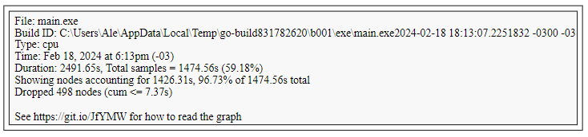
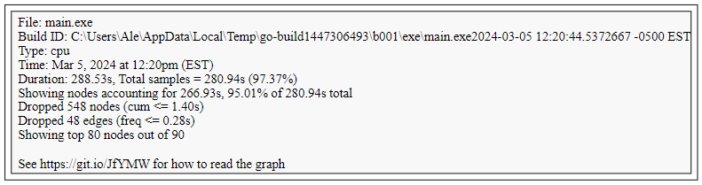
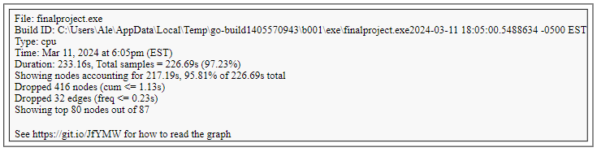

## FINAL PROJECT

Desplegado en AWS: http://ec2-18-219-45-173.us-east-2.compute.amazonaws.com/

# Funciones de Búsqueda de Correos Electrónicos

Este README proporciona una descripción general del código relacionado con la búsqueda de correos electrónicos en un sistema. El código consta de varias funciones que se utilizan para realizar la búsqueda y manejar las solicitudes HTTP.

## Funciones Principales

### 1. SetupRouter()

- Configura un enrutador HTTP utilizando el paquete `chi`.
- Agrega middleware para el registro, recuperación y manejo de CORS.
- Monta un middleware para la depuración en una ruta específica.
- Define una ruta para el manejo de solicitudes de búsqueda.

### 2. Search(w http.ResponseWriter, r *http.Request)

- Controlador HTTP que maneja las solicitudes de búsqueda de correos electrónicos.
- Decodifica el cuerpo JSON de la solicitud HTTP.
- Llama a la función `GetEmails` para realizar la búsqueda de correos electrónicos.
- Devuelve los resultados de la búsqueda al cliente en formato JSON.

### 3. GetEmails(email string) (models.ZincResponse, error)

- Realiza una solicitud de búsqueda de correos electrónicos al servidor de búsqueda.
- Codifica los parámetros de búsqueda en formato JSON.
- Realiza la solicitud HTTP utilizando autenticación básica.
- Maneja la respuesta del servidor y la decodifica en una estructura de datos.
- Devuelve los resultados de la búsqueda en una estructura específica.

## Otras Funciones

- `makeRequestWithAuth(method string, url string, body string) (*http.Request, error)`: Construye una solicitud HTTP con autenticación básica.
- `CheckIfIndexExists() *http.Response`: Verifica si un índice existe en el servidor de búsqueda.
- `CreateIndex(records []models.Email) error`: Crea un índice en el servidor de búsqueda utilizando los datos proporcionados.
- `GetEmailsDir() ([]models.Email, error)`: Obtiene los correos electrónicos de un directorio y los procesa.

## Estructuras de Datos Relevantes

- `JsonBody`: Estructura utilizada para deserializar el cuerpo JSON de una solicitud HTTP.
- `models.ZincResponse`: Estructura que representa la respuesta de la búsqueda de correos electrónicos.
- `models.Email`: Estructura que representa un correo electrónico.
- `models.EmailSearchResult`: Estructura que representa el resultado de una búsqueda de correos electrónicos.

# Visualizacion

## Resumen del Código

El código consiste en un componente Vue.js que proporciona una interfaz de usuario para buscar y visualizar correos electrónicos. Aquí está un resumen de las principales características y funciones del código:

- **Componente Vue.js**: El componente Vue.js se encarga de renderizar la interfaz de usuario. Incluye un campo de búsqueda, una lista de correos electrónicos coincidentes y modales para mostrar los detalles del correo electrónico seleccionado o mensajes de error.

- **Funciones JavaScript/TypeScript**:
  - `handleSearch`: Función que se activa al realizar una búsqueda de correos electrónicos. Realiza una solicitud HTTP al servidor para buscar correos electrónicos que coincidan con el término de búsqueda proporcionado. Actualiza la lista de correos electrónicos coincidentes y muestra un mensaje de error si no se encuentran resultados.
  
  - `openEmailModal`: Función que se activa al hacer clic en un correo electrónico de la lista. Abre un modal que muestra los detalles del correo electrónico seleccionado.
  
  - `closeModal`: Función para cerrar el modal de detalles del correo electrónico.
  
  - `clearError`: Función para limpiar el mensaje de error.

- **Estructuras de Datos**:
  - `IEmail`: Interfaz que representa la estructura de un correo electrónico.
  - `IEmailResponse`: Interfaz que representa la estructura de respuesta de un correo electrónico.
  
- **Componentes Externos**:
  - `EmailSearchBar`: Componente externo que proporciona un campo de búsqueda de correos electrónicos.

## Tecnologías

- `Backend`: Golang
- `Base de Datos`: Zincsearch
- `Api Router`: chi
- `Interfaz`: Vue 3
- `CSS`: Tailwind

Este código proporciona una base sólida para desarrollar un sistema de gestión de correos electrónicos con capacidades de búsqueda avanzadas y una interfaz de usuario intuitiva.

## Optimización

El tiempo de ejecución de la aplicación se optimizó con el uso de goroutines en Go.
La goroutines permiten la concurrencia de manera eficiente, recorre a través del directorio de los emails y permite ejecutar múltiples operaciones de E/S (Entrada/Salida) simultáneamente. Esto puede resultar en un uso más eficiente de los recursos del sistema.
Al procesar múltiples archivos simultáneamente, se redujo la duración total de las operaciones significativamente. 

Imagen generada el 18 de febrero de 2024 (Disco D:)

Imagen generada el 5 de marzo de 2024 (Disco C:)

Imagen generada el 11 de marzo de 2024 (Disco C:)

